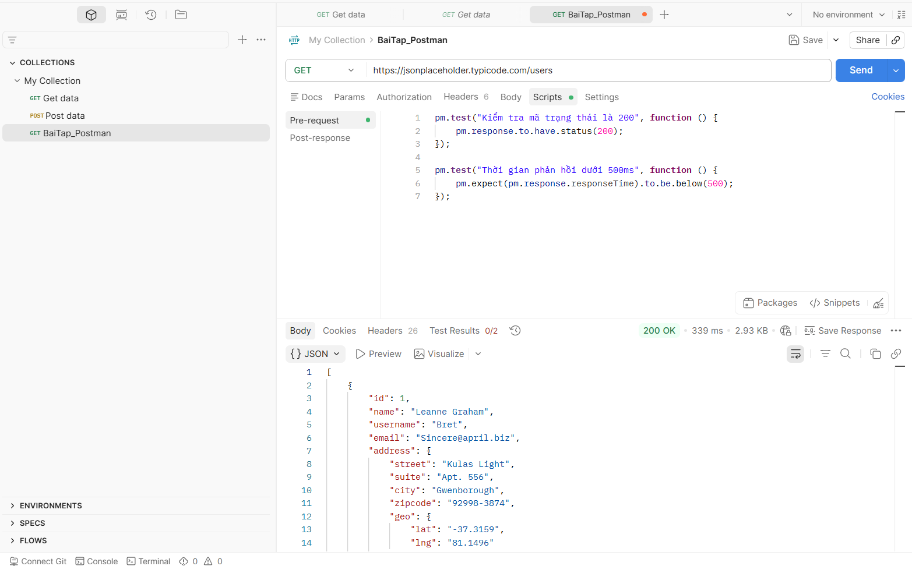
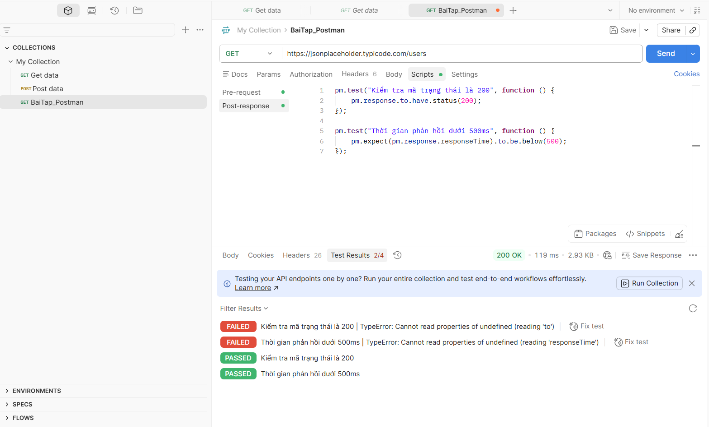
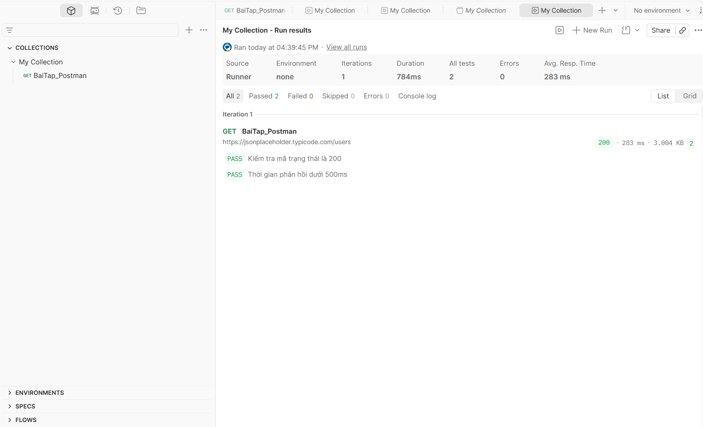

# 🚀 BÁO CÁO NGHIÊN CỨU VÀ THỰC HÀNH KIỂM THỬ API BẰNG CÔNG CỤ POSTMAN

## 📌 1. THÔNG TIN CHUNG
- **Môn học**: Đánh giá và kiểm thử chất lượng phần mềm
- **Tên bài tập**: Bài tập thực hành Postman & API Testing Basic
- **Sinh viên thực hiện**: Nguyễn Anh Đức
- **Mã sinh viên**: 23010650

---

## 📚 2. CƠ SỞ LÝ THUYẾT (THEORETICAL BACKGROUND)

### 2.1. API và RESTful API là gì?
- **API (Application Programming Interface)**: Là giao diện lập trình ứng dụng, đóng vai trò như một cầu nối trung gian cho phép hai ứng dụng hoặc hệ thống khác nhau có thể giao tiếp, trao đổi và truyền tải dữ liệu qua lại lẫn nhau.
- **RESTful API**: Là một tiêu chuẩn thiết kế API phổ biến dựa trên kiến trúc REST (Representational State Transfer). Hệ thống này sử dụng các phương thức HTTP tiêu chuẩn để quản lý, thao tác và tối ưu hóa luồng dữ liệu giữa Client và Server.

### 2.2. Các thành phần chính của một HTTP Request
Để giao tiếp và gửi yêu cầu tới một API, người kiểm thử cần cấu hình một Request bao gồm các thành phần cốt lõi sau:
1. **HTTP Methods (Phương thức)**: Định nghĩa hành động muốn thực hiện.
   - `GET`: Lấy hoặc đọc dữ liệu từ hệ thống (Đây là phương thức chính được sử dụng trong bài tập này).
   - `POST`: Tạo mới một bản ghi dữ liệu.
   - `PUT` / `PATCH`: Cập nhật dữ liệu đã tồn tại trên hệ thống.
   - `DELETE`: Xóa bỏ tài nguyên dữ liệu.
2. **URL / Endpoint**: Địa chỉ định danh duy nhất của tài nguyên hoặc dịch vụ trên máy chủ (Server).
3. **Headers**: Chứa siêu dữ liệu (Metadata) nhằm cung cấp thông tin cấu hình cho request, ví dụ như kiểu định dạng dữ liệu trả về (`Content-Type: application/json`).
4. **Body**: Phần dữ liệu chi tiết gửi kèm lên Server (thường được áp dụng cho các phương thức POST, PUT hoặc PATCH).

### 2.3. Công cụ kiểm thử Postman
Postman là một trong những API Client mạnh mẽ và phổ biến nhất trên thế giới hiện nay dành cho các Nhà phát triển (Developers) và Kỹ sư kiểm thử (QA/Testers). Công cụ này hỗ trợ toàn diện các tính năng:
- Khởi tạo và gửi các HTTP Request một cách trực quan thông qua giao diện đồ họa.
- Quản lý và phân loại các yêu cầu kiểm thử một cách khoa học theo cấu trúc thư mục (**Collection**).
- Viết mã kiểm thử tự động (Automation Testing Assertions) linh hoạt bằng ngôn ngữ **JavaScript**.
- Tự động hóa việc chạy kiểm thử hàng loạt và xuất báo cáo thông qua tính năng **Collection Runner**.

---

## 🛠️ 3. MÔI TRƯỜNG VÀ KỊCH BẢN KIỂM THỬ (TEST SCENARIOS)

### 3.1. Thông tin API thử nghiệm
Trong bài tập thực hành này, hệ thống sử dụng một Mock API theo tiêu chuẩn dữ liệu cộng đồng để tiến hành kiểm thử:
- **Base URL**: `https://jsonplaceholder.typicode.com`
- **Endpoint**: `/users`
- **Phương thức HTTP**: `GET`
- **Chức năng**: Truy vấn và trả về danh sách thông tin chi tiết (ID, Tên, Email, Địa chỉ...) của người dùng dưới định dạng dữ liệu cấu trúc JSON.

### 3.2. Kịch bản kiểm thử (Test Cases)
Bài tập thiết lập 02 kịch bản kiểm thử tự động (Assertion) để đánh giá tính chính xác và hiệu năng phản hồi từ hệ thống:

| Mã TC | Tên Kịch Bản | Mục Tiêu Kiểm Thử | Kết Quả Mong Đợi (Expected Result) |
| :--- | :--- | :--- | :--- |
| **TC-01** | Check Status Code | Xác thực phản hồi từ hệ thống máy chủ có thành công hay không. | API phải trả về HTTP Status Code đạt mã `200 OK`. |
| **TC-02** | Check Response Time | Đánh giá hiệu năng, tốc độ xử lý dữ liệu và phản hồi của Server. | Thời gian phản hồi của hệ thống phải nhanh, tối ưu dưới mức `500ms`. |

---

## 📊 4. QUY TRÌNH THỰC HIỆN VÀ KẾT QUẢ MINH HỌA

### 4.1. Khởi tạo và Thiết lập Request
- Tiến hành cài đặt phần mềm Postman Desktop trên máy tính và đăng nhập đồng bộ hóa dữ liệu thông qua tài khoản Google.
- Khởi tạo cấu trúc dữ liệu gồm một thư mục Collection lớn mang tên `My Collection`. Bên trong khởi tạo một Request cụ thể tên là `BaiTap_Postman`, cấu hình theo phương thức `GET` kết hợp với đường dẫn Endpoint của dịch vụ.

*Hình ảnh minh họa kết quả khi gửi Request thành công và nhận về dữ liệu cấu trúc JSON:*


### 4.2. Xây dựng mã kiểm thử tự động (Test Scripts)
Mã kiểm thử được lập trình bằng ngôn ngữ JavaScript và được đặt chính xác tại thẻ **Post-res** (Mã nguồn sẽ tự động kích hoạt ngay sau khi Postman nhận được phản hồi từ Server). Đoạn code cụ thể được triển khai như sau:

```javascript
// Kiểm tra mã trạng thái HTTP trả về từ hệ thống
pm.test("Kiểm tra mã trạng thái là 200", function () {
    pm.response.to.have.status(200);
});

// Kiểm tra hiệu năng xử lý tốc độ (Thời gian phản hồi)
pm.test("Thời gian phản hồi dưới 500ms", function () {
    pm.expect(pm.response.responseTime).to.be.below(500);
});
```

*Hình ảnh minh họa tab Test Results hiển thị trạng thái PASSED màu xanh lá cây đạt yêu cầu:*


### 4.3. Kiểm thử tự động hàng loạt với Collection Runner
Để đảm bảo tất cả các kịch bản kiểm thử đều vận hành ổn định, đồng bộ và không phát sinh ra bất kỳ lỗi logic hay gián đoạn mạng nào, tính năng **Collection Runner** đã được kích hoạt để quét và thực thi tự động toàn bộ thư mục bài tập.

*Hình ảnh minh họa báo cáo tổng hợp từ chức năng Collection Runner với chỉ số lỗi Errors = 0:*


---

## 💾 5. HƯỚNG DẪN REVIEW BÀI TẬP (DÀNH CHO NGƯỜI CHẤM BÀI)
Để kiểm tra trực tiếp cấu hình kỹ thuật cùng các kịch bản test script trên môi trường Postman cá nhân, giảng viên có thể thực hiện theo các bước đơn giản sau:
1. Tải file dữ liệu gốc `My Collection.postman_collection.json` được đính kèm trực tiếp trong Repository này về máy tính.
2. Mở ứng dụng Postman, nhấn chọn vào nút **Import** nằm ở góc trên cùng bên trái giao diện làm việc và tải tệp tin `.json` vừa download lên.
3. Toàn bộ cấu trúc Collection, đường dẫn API cấu hình sẵn cùng mã nguồn Test Scripts sẽ tự động được phục hồi chính xác 100% để tiến hành chấm điểm.

## 📝 6. KẾT LUẬN VÀ BÀI HỌC KINH NGHIỆM
Qua quá trình nghiên cứu tài liệu và hoàn thành bài tập thực hành này, sinh viên đã đạt được các mục tiêu giáo trình đề ra:
- Sử dụng thành thạo giao diện làm việc, các phím tắt và các tính năng cốt lõi của công cụ Postman.
- Hiểu sâu sắc hơn về cấu trúc của giao thức HTTP, cách phân tích cú pháp dữ liệu kiểu JSON và ý nghĩa thực tế của các nhóm mã Status Code.
- Bước đầu tiếp cận và hình thành tư duy viết mã kiểm thử tự động (Automation Testing), giúp tối ưu hóa thời gian chạy thử, tăng năng suất và độ chính xác vượt trội so với các quy trình kiểm thử thủ công (Manual Testing) truyền thống.
